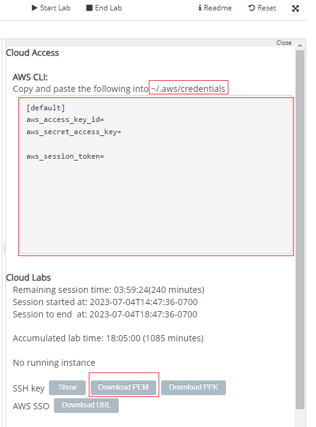

# Terraform - prometheus - Grafana
# Provision and deploy the Prometheus and Grafana on AWS using Terraform and Docker.
- [Introdução](#Introdução)
- [Pre-requisitos](#pre-requisitos)
- [Instalação e configuração](#Instalação-e-configuração)
- [Result](#Result)
- [Node Exporter](#Node Exporter)


# Introdução
Desenvolvido para utilização com a awsacademy.
Testado no ubuntu e linux-wsl2

# Pre-requisites
* Certifique-se de instalar a versão mais recente do [terraform](https://learn.hashicorp.com/terraform/getting-started/install.html)

# Instalação e configuração
Clone o projeto localmente

Se você quiser alterar quais alvos devem ser monitorados ou fazer alterações de configuração, edite o arquivo prometheus.yml.
A seção de alvos é onde você define o que deve ser monitorado pelo Prometheus (por padrão, monitora a própria instancia e a instancia com postgree)

Neste projeto utilizamos as seguintes configurações.
* EC2 AMI - ami-053b0d53c279acc90 (Ubuntu Server 22.04)
* EC2 Instance Type - t2.micro
* Region - us-east-1
* VPC - 10.0.0.0/16
* Subnet - 10.0.1.0/24
* Port Opened - 3000, 9090

# Steps to run the provisioning in terraform
1. Clone the repo
```
git clone https://github.com/GabrieldeFreire/continuous_monitoring
```
2. Configure as credenciais da aws  
2.1 Copie a credencial em "AWS Details"/AWS CLI para "~/.aws/credentials"  
2.2 Faça o download da chave SSH key `pem` e salve no repositório como "labsuser.pem"  
  

3. Inicialização do Terraform 
```
terraform init
```
4. Criação do plano de execução
```
terraform plan
```
5. Aplicação do terraform
```
terraform apply
```


# Resultado de apply do terraform
```
Apply complete! Resources: 13 added, 0 changed, 0 destroyed.

Outputs:

Grafana_URL = http://54.169.85.67:3000
Prometheus_URL = http://54.169.85.67:9090
```

